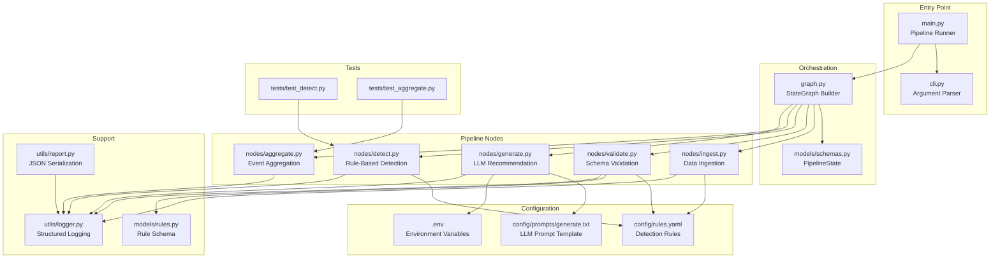
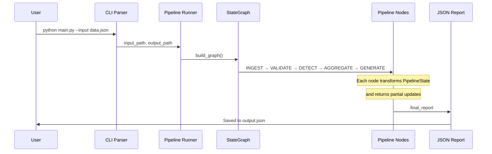

# 🛠️ SRE Remediation Agent — LangGraph Pipeline

> **An SRE-focused remediation agent that ingests system metrics, detects anomalies via configurable rules, and generates actionable remediation recommendations using LLMs — built with LangGraph, Pydantic, and modern Python tooling.**

[](https://www.python.org/downloads/)
[](https://docs.pydantic.dev/)
[](LICENSE)
[](../CONTRIBUTING.md)

---

## 📖 Description

This project implements an **SRE Remediation Agent** — a production-ready pipeline that ingests system metrics, detects anomalies using configurable rule-based detection, and generates actionable remediation recommendations via LLMs. It demonstrates how to build reliable, maintainable AI-powered operations tools using the **LangGraph StateGraph** paradigm with strict type safety at every stage.

Key capabilities include:

- **Metric Ingestion** — Load and clean structured system metrics from JSON sources
- **Schema Validation** — Enforce data contracts using Pydantic V2 models
- **Rule-Based Detection** — Identify anomalies using externalized YAML rules (thresholds, conditions, severity levels)
- **Event Aggregation** — Group related anomalies into actionable incidents
- **LLM Recommendations** — Generate structured remediation plans with structured output enforcement

Built on **Clean Architecture** principles, this agent separates concerns cleanly across orchestration, pipeline nodes, and support layers — making it trivial to adapt to any monitoring stack or LLM provider.

### 🏗️ Architecture Philosophy

```
┌─────────────────────────────────────────────────────────┐
│                    ORCHESTRATION LAYER                   │
│              LangGraph StateGraph (DAG)                  │
├─────────────────────────────────────────────────────────┤
│                    PIPELINE NODES                        │
│  ┌──────────┐ ┌──────────┐ ┌──────────┐ ┌──────────┐ ┌──────────┐
│  │ Ingest   │ → │ Validate │ → │ Detect   │ → │Aggregate │ → │Generate│
│  │          │   │          │   │          │   │          │   │        │
│  │ Load     │   │ Schema   │   │ Rule     │   │ Event    │   │ LLM    │
│  │ & Clean  │   │ Verify   │   │ Match    │   │ Grouping │   │ Struct │
│  └──────────┘   └──────────┘   └──────────┘   └──────────┘   └──────────┘
├─────────────────────────────────────────────────────────┤
│                    SUPPORT LAYERS                        │
│  ┌──────────┐ ┌──────────┐ ┌──────────┐                 │
│  │ Models   │ │ Config   │ │ Utils    │                 │
│  │ (Pydantic)│ │(YAML)   │ │ (Logger, │                 │
│  │          │ │         │ │  Report)  │                 │
│  └──────────┘   └──────────┘   └──────────┘             │
└─────────────────────────────────────────────────────────┘
```

---

## ✨ Key Features

### 🔒 Type Safety & Validation
- **Pydantic V2** models enforce strict data contracts at every pipeline stage
- Automatic validation of configuration files (YAML schemas)
- Graceful degradation on invalid input — pipeline stops cleanly, never crashes

### 🧩 Modular Node Architecture
- Each pipeline stage is an **independent, testable node**
- Clear input/output contracts via `TypedDict` state schema
- Easy to extend: add new nodes without modifying existing logic

### ⚙️ Externalized Configuration
- **YAML-driven rules engine** — modify detection logic without code changes
- **Environment-based settings** — `.env` for secrets, `LOG_LEVEL` for verbosity
- Prompt templates stored separately from code (`config/prompts/`)

### 🤖 LLM Integration
- Structured output via `with_structured_output(PydanticModel)`
- Automatic fallback when LLM is unavailable
- Temperature and token limits configurable via environment

### 🛠️ Developer Experience
- **`uv`** for fast dependency resolution and virtual environment management
- **Pytest** with comprehensive unit tests and helper fixtures
- **Custom JSON encoder** for Pydantic V2 serialization
- **Structured logging** with console + file handlers

### 🐳 Containerization (Optional)
- **Dockerfile** for reproducible builds
- **docker-compose.yml** for local development
- **CI/CD pipeline** via GitHub Actions (lint + test on push)

---

## 🏛️ Architecture & Design Patterns

### Technical Tree



### Data Flow



### State Schema

```python
# models/schemas.py — PipelineState (simplified)
class PipelineState(TypedDict):
    input_path: str                # Source file path
    raw_data: list[dict]           # Raw input records
    records: list[DataRecord]      # Validated records
    events: list[Event]            # Detected events/anomalies
    incidents: list[AggregatedEvent]  # Aggregated incidents
    final_report: dict | None      # Final LLM-generated report
```

---

## 🚀 How to Use

### Prerequisites

- **Python 3.11+**
- **[uv](https://github.com/astral-sh/uv)** — Fast Python package manager

### Installation

```bash
# Clone the boilerplate
git clone https://github.com/<your-username>/langgraph-pipeline-template.git
cd langgraph-pipeline-template

# Create virtual environment & install dependencies
uv venv --python 3.11
uv sync
```

### Configuration

```bash
# Copy environment template
cp .env.example .env

# Edit .env with your settings
# Required: LLM endpoint, API keys (if using external LLM)
```

### Running the Pipeline

```bash
# Run with default paths (data/sample_data.json → data/output.json)
uv run main.py

# Custom input/output paths
uv run main.py --input /path/to/input.json --output /path/to/output.json
```

### Running Tests

```bash
# Run all tests
uv run pytest

# Run with verbose output
uv run pytest -v

# Run with coverage
uv run pytest --cov=. --cov-report=html
```

### Docker (Optional)

```bash
# Build the image
docker build -t pipeline-template .

# Run with docker-compose
docker-compose up --build

# Run tests in container
docker-compose run --rm app pytest
```

---

## 🛠️ Makefile Usage

This project includes a **Makefile** to standardize common development commands. Make is a standard build tool widely used in the Python ecosystem and is recognized by technical recruiters as a sign of professional-grade projects.

### Why a Makefile?

Without a Makefile, team members must remember multiple commands for different environments:

| Task | Without Makefile | With Makefile |
|------|------------------|---------------|
| Setup | `uv venv --python 3.11 && uv sync` | `make setup` |
| Run | `uv run main.py` | `make run` |
| Test | `uv run pytest -v` | `make test` |
| Lint | `uv run flake8 .` | `make lint` |
| Docker Build | `docker build -t pipeline .` | `make docker-build` |
| Clean | `find . -name \*.pyc -delete && rm -rf .pytest_cache` | `make clean` |

### Available Commands

```bash
# Show help
make help

# Setup environment
make setup          # Create venv and install dependencies

# Development
make run            # Run the pipeline with default paths
make dev            # Run in development mode with verbose logging

# Testing
make test           # Run all tests
make test-coverage  # Run tests with coverage report
make lint           # Run flake8 linter
make check          # Run tests + lint

# Docker
make docker-build   # Build Docker image
make docker-run     # Run container
make docker-clean   # Remove Docker images

# Cleanup
make clean          # Remove temporary files and caches
```

### How It Works

The Makefile uses `uv run` to execute commands within the virtual environment, ensuring consistent behavior across all development machines. Each target is independent and can be run in isolation.

---

## 📁 Project Structure

```
langgraph-pipeline-template/
├── .env.example              # Environment configuration template
├── .gitignore                # Git ignore rules
├── .flake8                   # Flake8 linter configuration
├── pyproject.toml            # Project metadata & dependencies
├── uv.lock                   # Locked dependency versions
├── README.md                 # This file
├── Dockerfile                # Container build definition
├── docker-compose.yml        # Local development compose
├── Makefile                  # Common commands
│
├── config/                   # Externalized configuration
│   ├── rules.yaml            # Detection rules (YAML)
│   └── prompts/
│       └── generate.txt      # LLM prompt template
│
├── data/                     # Data directory
│   └── sample_data.json      # Sample input data
│
├── models/                   # Data models & schemas
│   ├── __init__.py
│   ├── schemas.py            # Pydantic models + PipelineState
│   └── rules.py              # Rule validation schemas
│
├── nodes/                    # Pipeline nodes (modular)
│   ├── __init__.py
│   ├── ingest.py             # Data loading & cleaning
│   ├── validate.py           # Schema validation
│   ├── detect.py             # Rule-based detection
│   ├── aggregate.py          # Event aggregation
│   └── generate.py           # LLM recommendation generation
│
├── tests/                    # Unit tests
│   ├── __init__.py
│   ├── test_detect.py        # Detection node tests
│   └── test_aggregate.py     # Aggregation node tests
│
├── utils/                    # Shared utilities
│   ├── __init__.py
│   ├── logger.py             # Structured logging setup
│   └── report.py             # JSON serialization helpers
│
└── main.py                   # Entry point
```

---

## 🧩 Extending the Template

### Adding a New Pipeline Node

```python
# nodes/my_new_node.py
from models.schemas import PipelineState

def my_new_node(state: PipelineState) -> dict:
    """Process aggregated events and produce insights."""
    events = state.get("events", [])
    # ... processing logic ...
    return {"insights": insights}

# graph.py — Register the node
workflow.add_node("my_new_node", my_new_node)
workflow.add_edge("aggregate", "my_new_node")
workflow.add_edge("my_new_node", "generate")
```

### Modifying Detection Rules

Edit `config/rules.yaml` — no code changes required:

```yaml
rules:
  - name: custom_threshold
    type: threshold
    condition: metric_name
    threshold: 50
    metric: custom_metric
    severity: warning
    category: performance
    affected: [service_a, service_b]
    message: "High {metric_name} ({value})"
    priority: 5
```

---

## 🧪 Testing Strategy

Tests follow the **AAA pattern** (Arrange, Act, Assert):

```python
def test_empty_events_returns_empty_incidents():
    # Arrange
    state = {"events": []}
    
    # Act
    result = aggregate_node(state)
    
    # Assert
    assert result["incidents"] == []
```

Run tests with:

```bash
uv run pytest -v --tb=short
```

---

## 🤝 Contributing

Contributions are welcome! Please follow these steps:

1. Fork the repository
2. Create a feature branch (`git checkout -b feature/amazing-feature`)
3. Commit your changes (`git commit -m 'Add: amazing feature'`)
4. Push to the branch (`git push origin feature/amazing-feature`)
5. Open a Pull Request

---

## 📜 License

This project is licensed under the [MIT License](LICENSE). Feel free to use this boilerplate for your own projects.

---

## 🙏 Acknowledgments

- **[LangGraph](https://github.com/langchain-ai/langgraph)** — Pipeline orchestration framework
- **[Pydantic](https://docs.pydantic.dev/)** — Data validation via Python type annotations
- **[uv](https://github.com/astral-sh/uv)** — Lightning-fast Python package manager
- **[Langchain](https://github.com/langchain-ai/langchain)** — LLM integration toolkit

---

> **Built with Clean Architecture principles.** Separate concerns, enforce contracts, test thoroughly.
